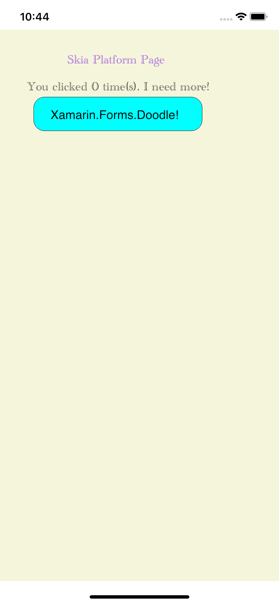
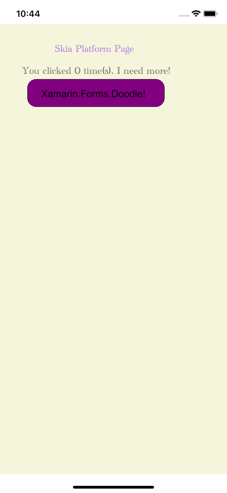

# Xamarin.Forms Doodle Backend

## About

We use Skia as a cross-platform UI rendering engine instead of implementing set of platform specific renderers for each native platform. This bring the cross-platform Xamarin.Forms SDK to a new (even greater) level of cross-platformability!

## Getting Started

1. Open Xamarin.Forms.Doodle.sln in Visual Studio
2. Run the `Xamarin.Forms.Doodle.DoodleApp.iOS` project

|Button Normal  | Button Pressed |
| ------------- | ------------- |
|   |   |

And Xamarin.Forms Xaml with working bindings is below:

```xaml
<StackLayout HorizontalOptions="Center" 
             VerticalOptions="Center" >
    <Label Text="{Binding Text}"
           HorizontalOptions="Center" />
    <Button Text="Xamarin.Forms.Doodle!" 
            HorizontalOptions="Center" 
            VerticalOptions="Center"
            Command="{Binding ExecuteAction}"/>
</StackLayout>
```

## Documentation

TBD

## Contributing

TBD

### Contributors

TBD
